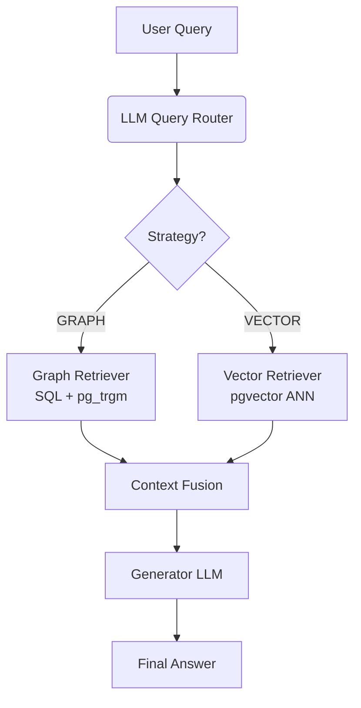

# 🧠 Hybrid Agentic GraphRAG System

This project implements a production-grade Retrieval-Augmented Generation (RAG) system that combines Knowledge Graph traversal (GraphRAG) with dense vector retrieval. It uses an LLM-based Query Router to dynamically select the optimal retrieval strategy based on the semantic intent of the user's query.

Built entirely with Python, FastAPI, PostgreSQL (+ pgvector), and Docker.

## 🌟 Key Features

- **Hybrid Agentic Retrieval:** Routes queries to Graph Traversal (for entity-specific facts) or Vector Search (for thematic summaries) automatically.
- **Strict Schema Validation:** Uses Pydantic to enforce a closed entity/relation ontology during LLM extraction, preventing hallucinated schemas.
- **Soft Validation Engine:** Flags invalid triples (e.g., domain/range type mismatches, missing evidence) without crashing the extraction pipeline.
- **Comprehensive Evaluation Suite:** Evaluates both Information Extraction (Hit@K, MRR against DocRED).
- **Production-Ready API:** FastAPI backend with connection pooling, graceful error handling, and a built-in Web UI for chat and feedback collection.
- **Fully Containerized:** Docker Compose setup for PostgreSQL, pgAdmin, and Grafana.

## 🏗️ System Architecture


## 📂 Project Structure
```
project_root/
├── app.py                     # FastAPI Web Server & UI endpoints
├── configs/                   # Configuration
├── static/                    # HTML/CSS/JS for the Chat Interface
├── src/
│   ├── db/                    # Database connection, schema, and ingestion logic
│   ├── extraction/            # LLM extractors and Pydantic schemas
│   ├── retrieval/             # Retrieval routing and the implementation of retrieval
│   ├── utils/                 
│   ├── rag/                   # RAGBase class
│   └── evaluation/            # Generate QA and IE metrics 
├── scripts/                   # Offline pipeline orchestrators (1_extract, 2_eval, etc.)
├── docker-compose.yml         # Orchestrates Postgres, pgAdmin, Grafana
├── pyproject.toml             # Python dependencies (managed by uv)
└── .env.example               # Environment variables
```

## 🏛️ Architecture & Design Decisions
1. **Hybrid Agentic RAG vs Standard RAG:** Standard RAG relies solely on vector similarity search, which fails on multi-hop questions. We use an LLM-based Query Router. If the query contains specific entities, it routes to the Graph Retriever. If thematic, it routes to the Vector Retriever.
2. **Strict vs Soft Validation:** We enforce strict Pydantic schemas for JSON structure and referential integrity. Semantic constraints (e.g., a `place of birth` relation must map a `Person` to a `Place`) are checked via a Soft Validator that flags invalid triples as `valid=False` in the database without crashing the pipeline.
3. **Separation of Offline vs Online:** The `scripts/` folder handles batch extraction/evaluation. The `app.py` server is stateless and only reads from the graph to generate answers.

## 🚀 Quick Start (Local Development)
### Prerequisites
- Docker and Docker Compose
- uv (Astral's fast Python package manager)
- OpenAI API Key

### Step 1: Clone and Configure
1. Clone this repository.
2. Copy the environment template:
```
cp .env.example .env
```
3. Open `.env` and add your `OPENAI_API_KEY` and set your DB credentials.
```
# Database Credentials
DB_USER=admin
DB_PASS=pass
DB_NAME=graphrag_db

# Port Mapping
DB_PORT=5433
PGADMIN_PORT=5050
GRAFANA_PORT=3000
FASTAPI_PORT=8000

# pgAdmin Config
PGADMIN_DEFAULT_EMAIL=admin@example.com
PGADMIN_DEFAULT_PASSWORD=admin

# API Keys
OPENAI_API_KEY=sk-your-api-key-here
```


### Step 2: Start the Database Infrastructure
Start PostgreSQL (with pgvector) and pgAdmin in the background:
```bash
docker compose up -d
```
- **pgAdmin** will be available at `http://localhost:5050`
- **PostgreSQL** will be available at localhost:5433

### Step 3: Install Python Dependencies
Use `uv` to sync your local virtual environment:
```bash
uv sync
```

### Step 4: Run the Offline Pipeline (Data Ingestion)
Before you can ask questions, the Knowledge Graph must be populated. Run the pipeline scripts in order:
1. Download `DocRED` dataset
```
uv run python scripts/00_ingestion.py
```
2. Extract Knowledge Graph from raw text (Costs OpenAI API credits)
```
uv run python scripts/01_extract_kg.py 
```
3. Generate synthetic Q&A pairs for RAG evaluation
```
uv run python scripts/02_generate_qa.py
```
4. Evaluate the retrieval step against Ground Truth (Hit@K, MRR)
```
uv run python scripts/04_evaluate_retrieval.py
```

### Step 5: Run the Web Application
Start the FastAPI server locally:
```
uv run uvicorn app:app --reload --port 8000
```
Chat UI will be available at `http://localhost:8000`

## ⚙️ Using the Makefile (Alternative)

For convenience, this project includes a `Makefile` and a `run_deployment.sh` script to automate environment setup, linting, and deployment.

To start of from the scratch, 
- first uncomment lines 13-16 in `run_deployment.sh` file.
- then use make as follows:
```bash
make run
```

#### Makefile Commands
- `make install`: Installs Python dependencies using uv.
- `make up-db`: Starts the Docker containers for Postgres, pgAdmin, and Grafana.
- `make pipeline`: Runs the 4 offline scripts sequentially to extract and evaluate the KG.
- `make run`: Executes `run_deployment.sh` (starts Docker, waits, runs pipeline, starts FastAPI).
- `make lint / make format`: Runs ruff to ensure code quality.


## 📊 Monitoring & Evaluation

This project separates **Offline Evaluation** from **Online Inference**.

- **Offline Metrics:** Stored in the `extraction_evals` and `rag_evaluations` tables. Track Extraction F1, Retrieval Hit@K.
- **Online Traces:** Every user interaction in the Web UI is logged to the `production_traces` table, capturing cost, latency, and user feedback (thumbs up/down).

To visualize these metrics, connect Grafana (included in the Docker Compose file) to your PostgreSQL database at `http://localhost:3000`.

(Grafana Data Source Setup: Host `postgres:5432`, Database `graphrag_db`, User `admin`, Password `pass`, SSL `disable`)

## 🛠️ Tech Stack

| Component | Technology |
|-----------|------------|
| API Framework | FastAPI, Uvicorn |
| Database | PostgreSQL, `pgvector`, `pg_trgm` |
| DB Driver | `psycopg` (v3), `psycopg-pool` |
| LLMs | OpenAI (`gpt-5.6-luna`, `nomic-ai/nomic-embed-text-v1.5`) |
| Data Validation | Pydantic |
| Package Manager | `uv` |
| Infrastructure | Docker, Docker Compose |


